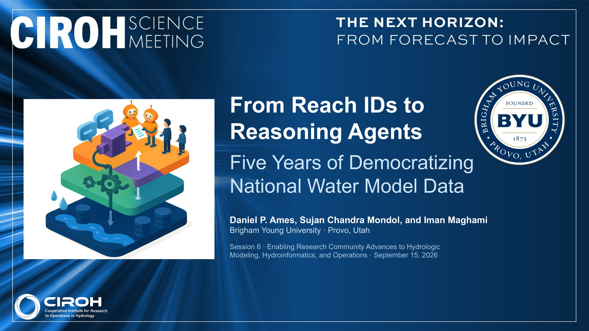

<!--
Over five years, this CIROH project has moved National Water Model access from reach-ID lookups for programmers to natural-language answers for everyone.
-->

---

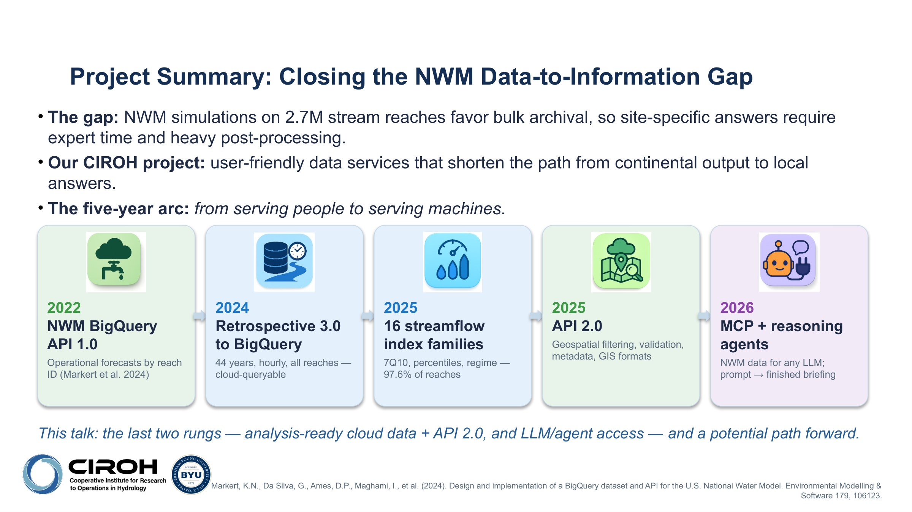

<!--
The gap: NWM output is built for bulk archival, so site-specific answers take expert time. The timeline shows one continuous CIROH investment, each step building on the one before: API 1.0, the retrospective in BigQuery, streamflow indices, API 2.0, and MCP plus reasoning agents.
-->

---

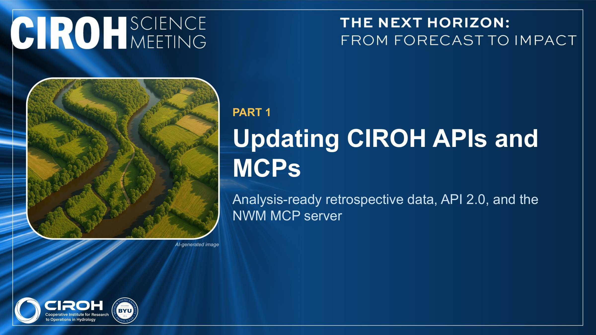

<!--
Part 1: updating CIROH APIs and building an MCP server.
-->

---

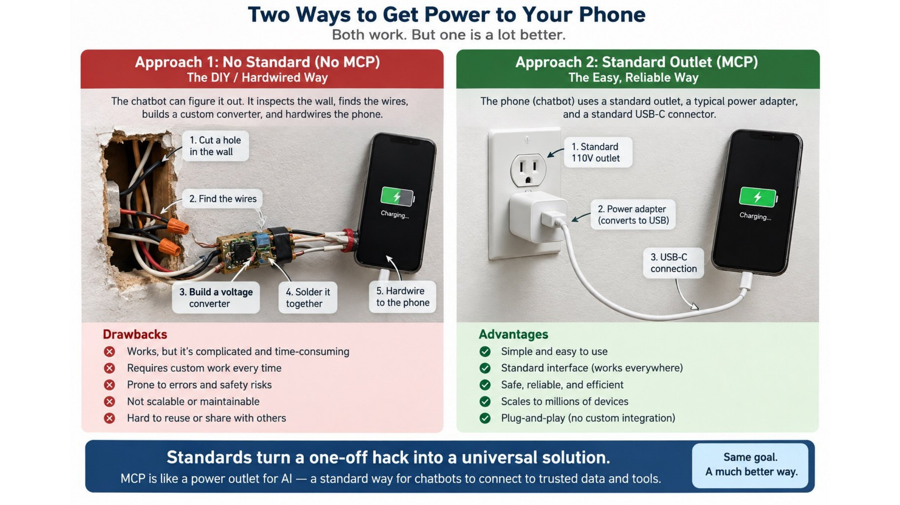

<!--
An analogy. Without a standard, a chatbot can still get data, but it is like cutting into the wall and hardwiring a phone: it works, but it is custom every time, error-prone, and cannot be shared. MCP is the standard outlet: any chatbot plugs into trusted data and tools the same way. That is what we built for the National Water Model.
-->

---

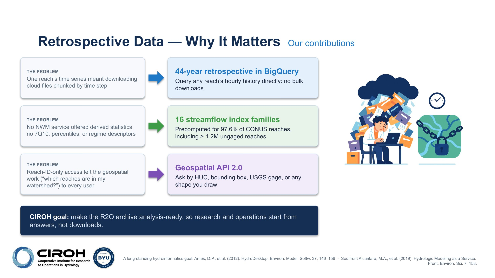

<!--
Three problems on the left, three contributions on the right: the 44-year retrospective in BigQuery, 16 precomputed streamflow index families covering 97.6% of reaches, and geospatial access through API 2.0. The goal is to start from answers, not downloads.
-->

---

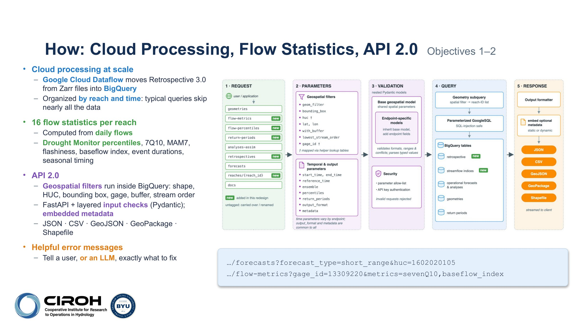

<!--
Cloud processing: Google Cloud Dataflow copies the 44-year retrospective from Zarr files into BigQuery, organized by reach and time. Flow statistics: 16 families per reach from daily flows. API 2.0: geospatial filters evaluated inside BigQuery, input checks, embedded metadata, and GIS formats. Error messages are written so a person, or an LLM, knows exactly what to fix. The two example calls at the bottom show the shape of a request.
-->

---

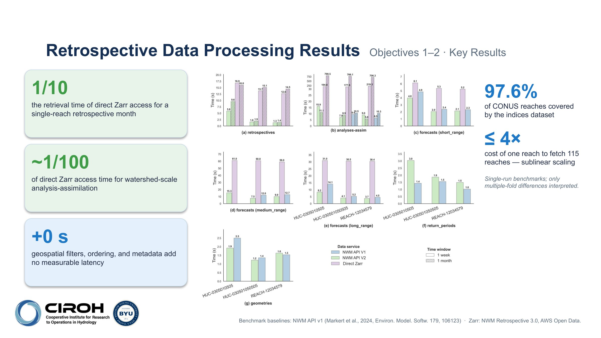

<!--
Hosted, partitioned BigQuery is up to an order of magnitude faster than reading the Zarr archive directly: one-tenth the time for a single-reach retrospective month and about 1/100 for watershed analysis-assimilation. Geospatial filters, ordering, and metadata add no measurable latency. The comparison is about the storage and access pattern (client-side reads of Zarr object storage vs. a hosted query service), not any particular tool. Single-run timings; only multiple-fold differences are interpreted.
-->

---

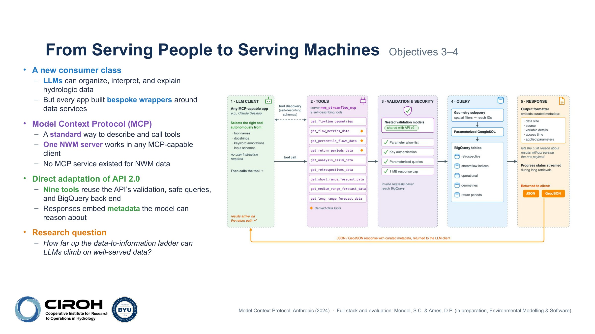

<!--
Everything so far serves people who write code. Language models are a new kind of consumer that reads documentation on its own. MCP is a standard way to describe and call tools; our NWM MCP server reuses API 2.0's validation and BigQuery back end as nine tools. The figure runs left to right: the client discovers tools, calls one, and the request is validated, queried, and returned with metadata.
-->

---

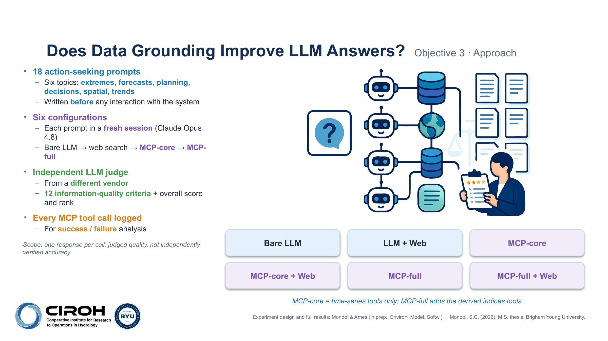

<!--
Experiment design: 18 prompts written in advance, six configurations each, and an independent judge from another vendor. The MCP-core vs. MCP-full split tests whether the precomputed statistics matter beyond raw data access.
-->

---

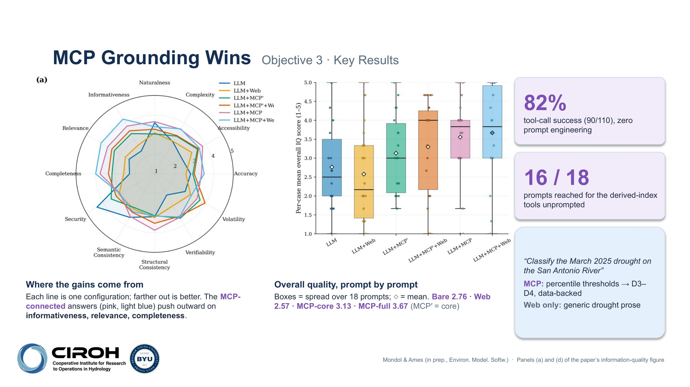

<!--
Left (radar): each colored line is one configuration across the 12 judged criteria; farther from the center is better. MCP-connected answers push outward on informativeness, relevance, and completeness; the bare LLM leads only on security, because it refuses more. Right (box plots): overall quality across the 18 prompts. Means rise from bare LLM 2.76 and web 2.57 to MCP-core 3.13 and MCP-full 3.67, so the derived indices add value beyond raw data. Tool calls succeeded 82% of the time without prompt engineering, and 16 of 18 prompts used the index tools unprompted. In the San Antonio example, the data pathway gives a real drought classification; web search gives generic prose.
-->

---

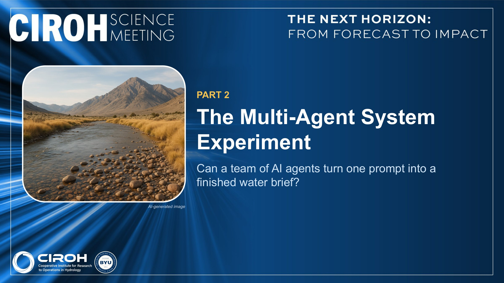

<!--
Part 2: can a team of AI agents turn one prompt into a finished water brief?
-->

---

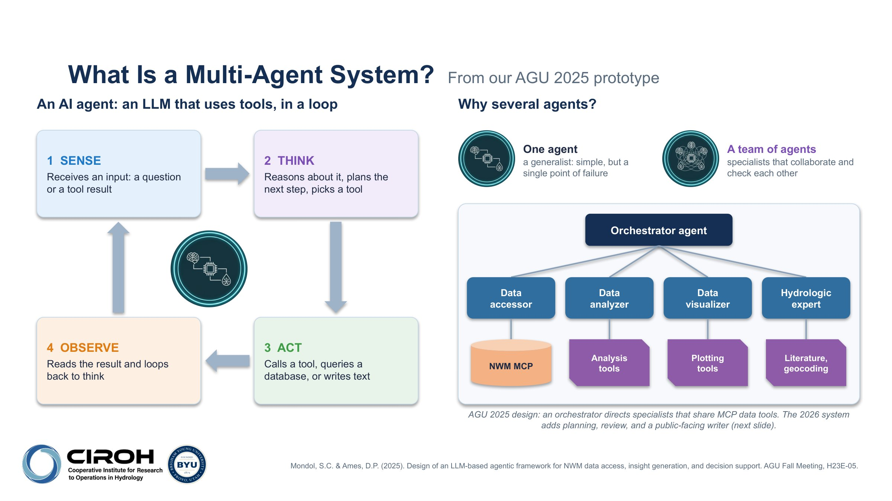

<!--
An AI agent is an LLM that uses tools in a loop: sense an input, think about the next step, act by calling a tool, observe the result, and repeat. A single agent is a generalist and a single point of failure. A multi-agent system is a team of specialists with an orchestrator. This design was presented at AGU in December 2025; the system in this study grows it into a planned pipeline with review and a public information officer.
-->

---

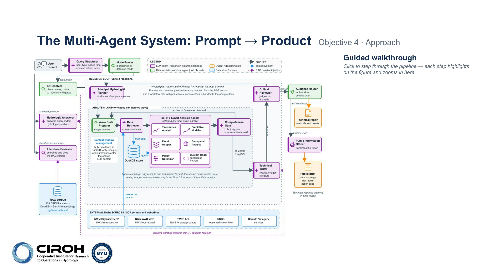

<!--
The pipeline, step by step on the following slides: 1 prompt structuring and mode routing; 2 planner (redesign loop, up to 3 times); 3 data retrieval into DuckDB (context management); 4 parallel expert-agent waves; 5 completeness gate, technical writer, and critical reviewer; 6 audience routing (technical report vs. public brief). Built on Google ADK, with deterministic loops around LLM reasoning. Data: NWM MCP plus USGS, NWPS, climate, snow, evapotranspiration, and imagery services. Tools: PyDRGHT, FIMserv, Prophet, SciPy, GeoPandas, and sandboxed Python.
-->

---

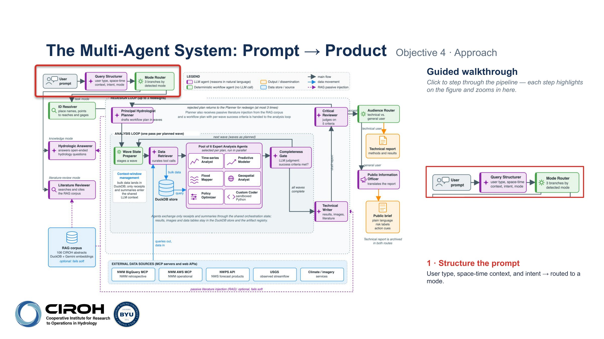

<!--
Step 1: structure the prompt and route it.
-->

---

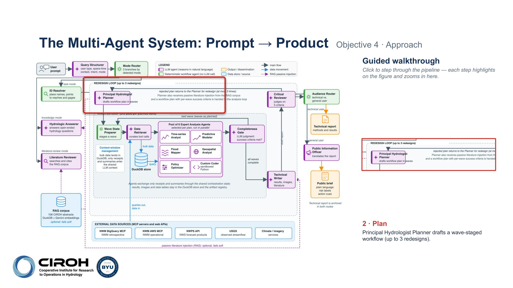

<!--
Step 2: the planner drafts a staged workflow plan.
-->

---

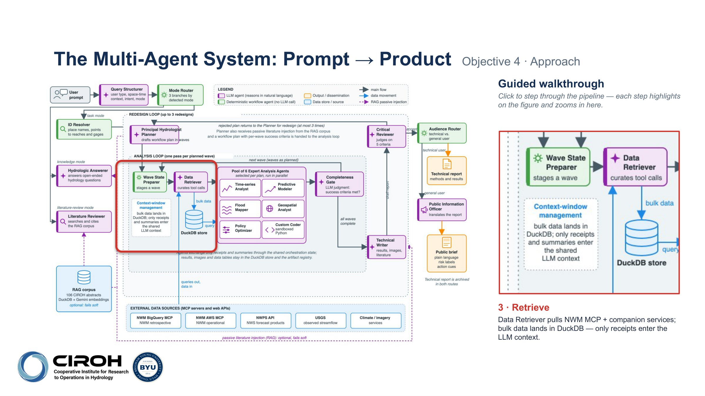

<!--
Step 3: the data retriever pulls data into a local DuckDB store; only summaries enter the shared context.
-->

---

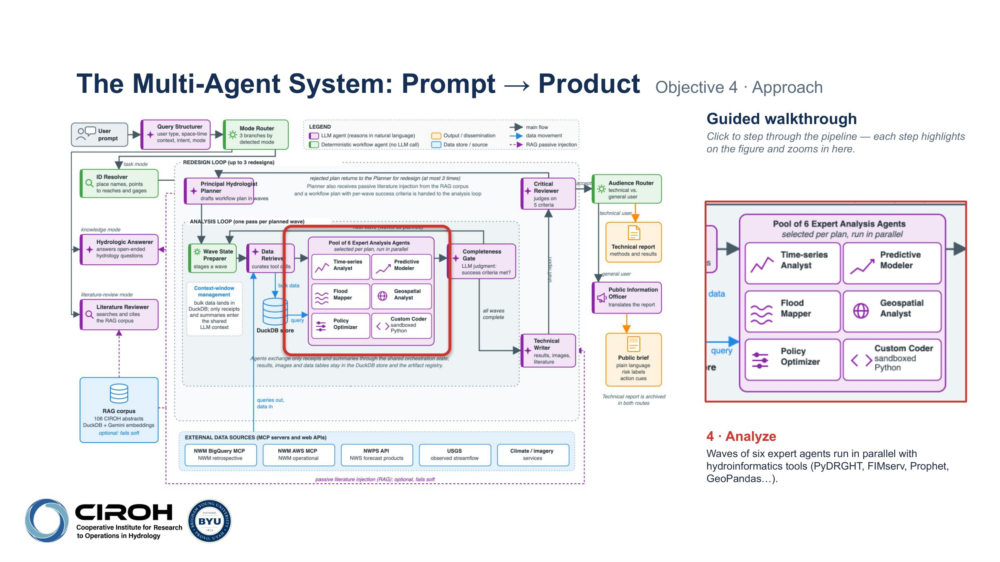

<!--
Step 4: expert analysis agents work in parallel waves.
-->

---

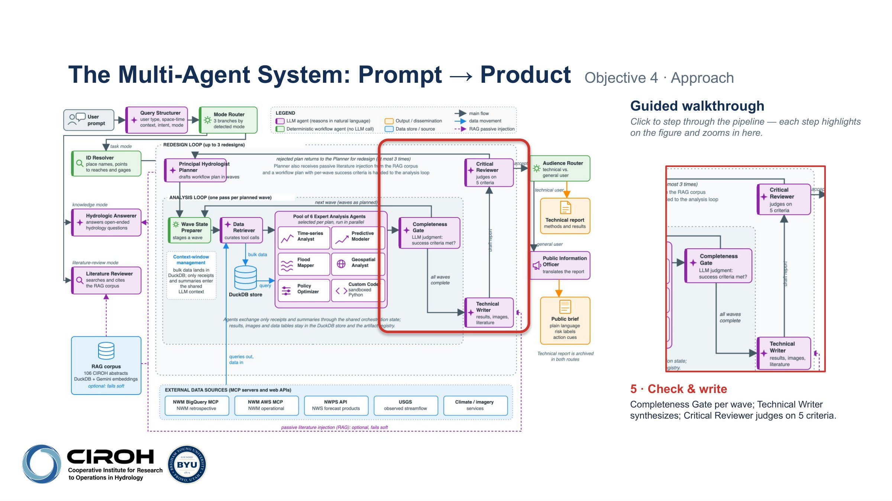

<!--
Step 5: a completeness gate checks each wave; the technical writer drafts the report and the critical reviewer judges it.
-->

---

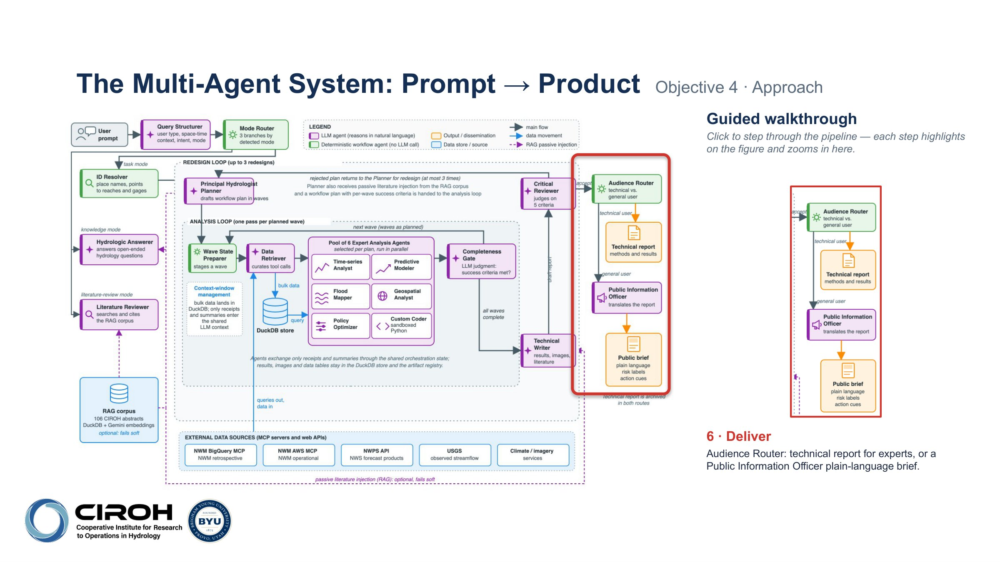

<!--
Step 6: the report goes to technical users, or through the public information officer to a plain-language brief.
-->

---

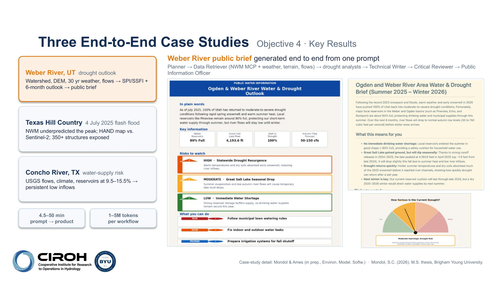

<!--
The brief shown is from the Weber River drought outlook, one of three case studies that all ran end to end. It shows risk levels (high: statewide drought resurgence; moderate: Great Salt Lake seasonal drop; low: immediate water shortage), recommended actions, and a drought gauge. Runs took 4.5 to 50 minutes and 1 to 5 million tokens.
-->

---

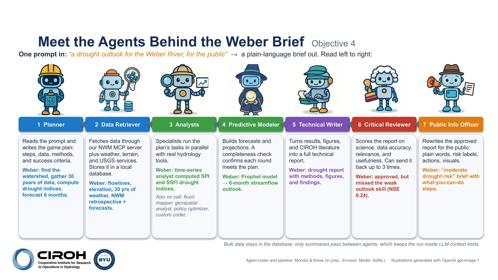

<!--
Each robot is one agent, read left to right. 1 Planner writes the plan. 2 Data Retriever pulls NWM data through our MCP, plus weather, terrain, and USGS data, into a local database. 3 Analysts run tasks in parallel; for Weber, the time-series analyst computed SPI and SSFI drought indices. There are six specialist analysts in all; the others (flood mapper, geospatial analyst, policy optimizer, sandboxed custom coder) were not central to this run. 4 Predictive Modeler built a Prophet six-month outlook; a completeness check confirms each round of work meets the plan. 5 Technical Writer drafts the report. 6 Critical Reviewer scores it and can send it back up to three times; here it approved the report but missed the weak outlook skill. 7 Public Information Officer rewrote it as the public brief.
-->

---

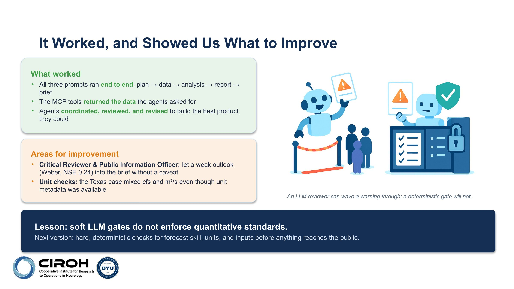

<!--
The system worked: every prompt ran end to end, the MCP delivered data, and the agents planned, analyzed, wrote, reviewed, and revised. Two areas to improve: the critical reviewer and public information officer let a weak Prophet outlook (NSE 0.24) into the Weber brief without a caveat, and the Texas run mixed units. Lesson: do not rely on an LLM to enforce quantitative standards; put hard checks in the pipeline. Today the system is a research prototype and analyst's assistant with a human in the loop.
-->

---

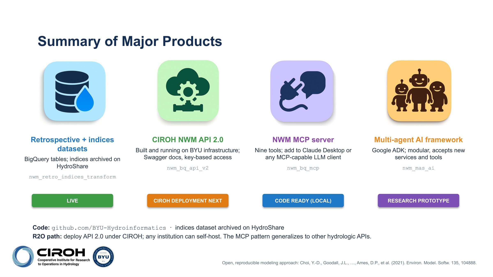

<!--
Status of the four products: the datasets are live in BigQuery, with the indices archived on HydroShare. API 2.0 is built and running on BYU infrastructure, with deployment under CIROH as the next step. The MCP server can be run locally in Claude Desktop or any MCP client. The multi-agent framework is a research prototype.
-->

---

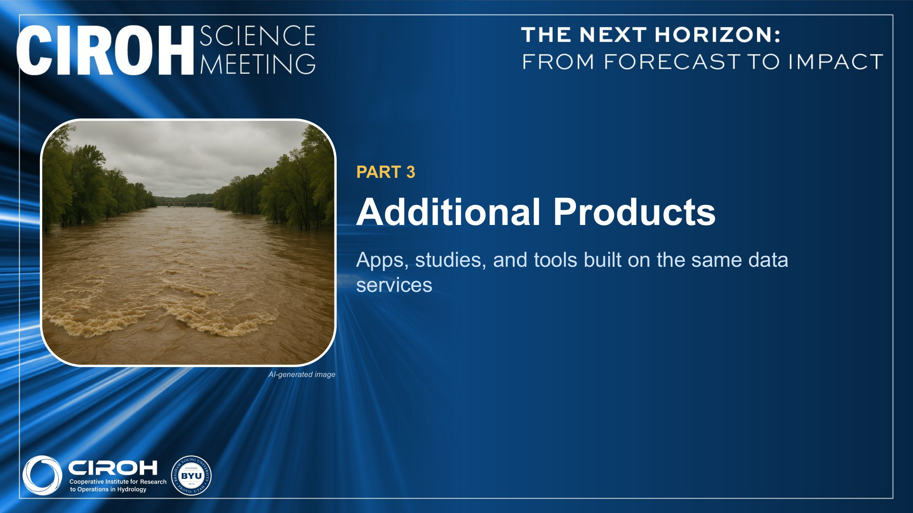

<!--
Part 3: other work in the lab built on the same data services.
-->

---

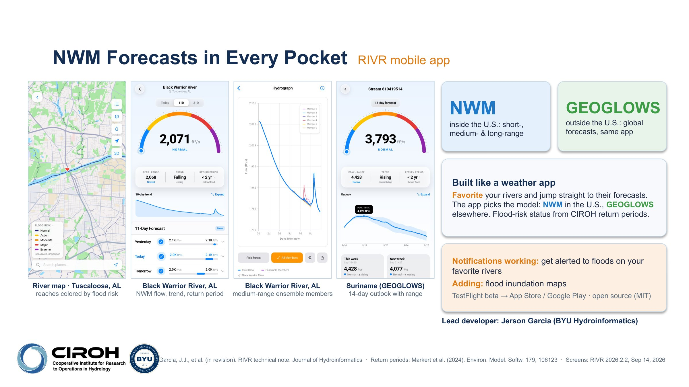

<!--
RIVR works like a weather app: favorite the rivers you care about and jump straight to their forecasts. Inside the U.S. it shows the NWM; outside the U.S. it switches to GEOGLOWS (the Suriname screen). Flood-risk status comes from the CIROH return-period table. Notifications alert you to floods on your favorite rivers, and flood inundation maps are being added. Development is led by Jerson Garcia; the app is in TestFlight, headed to the app stores, and open source.
-->

---

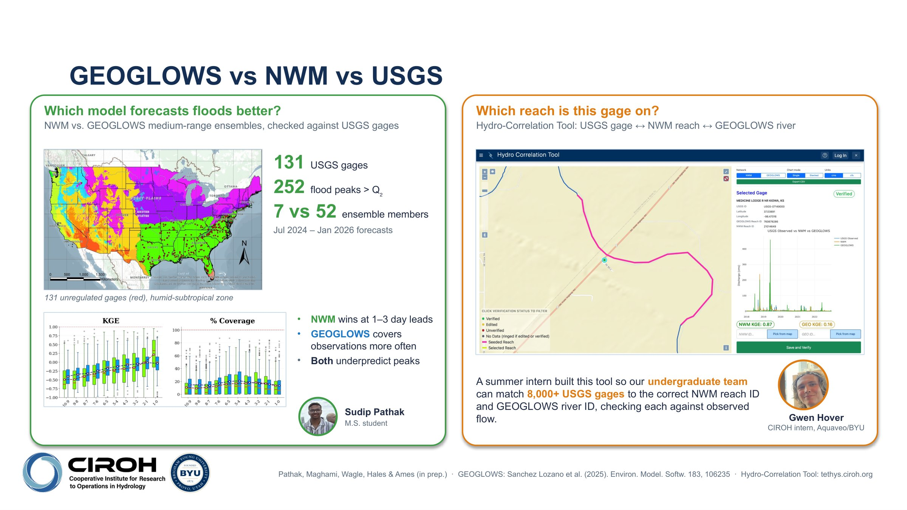

<!--
Left: a comparison of NWM and GEOGLOWS medium-range flood forecasts at 131 unregulated USGS gages across the humid-subtropical U.S., covering 252 flood peaks from July 2024 to January 2026. NWM is better at 1 to 3 day leads; GEOGLOWS' 52-member ensemble brackets observations more often; both underpredict peaks. Right: comparisons like this need each gage matched to the right NWM reach and GEOGLOWS river. The Hydro-Correlation Tool, built during a CIROH summer internship, lets an undergraduate team match 8,000+ USGS gages, checking each match against observed and simulated flow.
-->

---

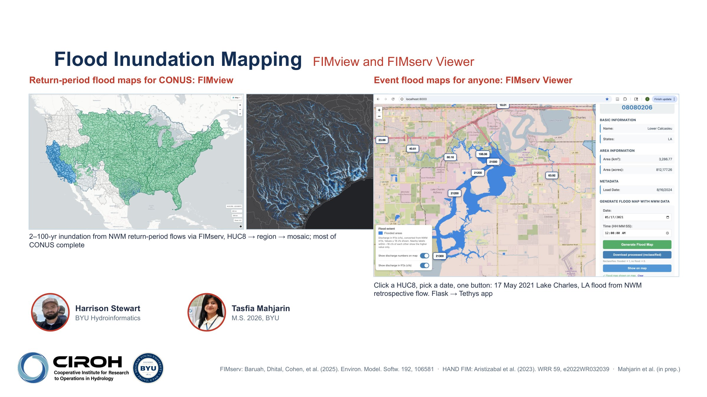

<!--
Two tools wrap the University of Alabama's FIMserv package so non-programmers can use it. Left: FIMview computes 2- to 100-year flood maps for every HUC8 from NWM return-period flows and mosaics them regionally; most of CONUS is complete. Right: FIMserv Viewer lets anyone click a watershed, choose a date, and map an event flood from the NWM retrospective, here the May 17, 2021 Lake Charles flood.
-->

---

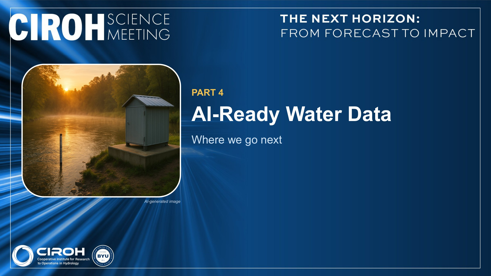

<!--
Part 4: where we go next.
-->

---

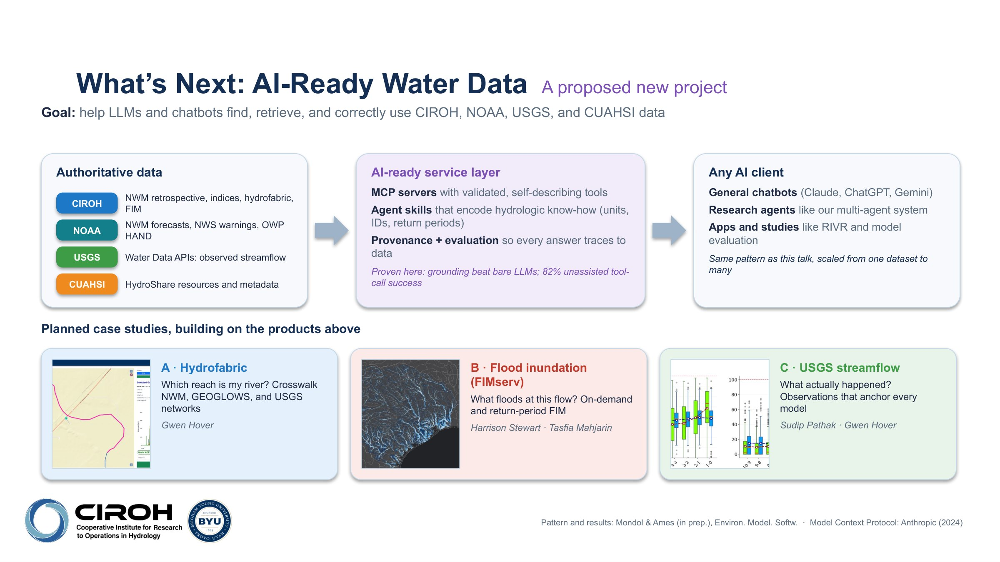

<!--
The pattern works for one dataset: well-served NWM data, an MCP server, and agents that reason over it. The next step is to generalize it, making CIROH, NOAA, USGS, and CUAHSI data AI-ready so any chatbot or agent can find, retrieve, and correctly use it. Three pieces: authoritative data, an AI-ready service layer (MCP servers, agent skills with hydrologic know-how, provenance and evaluation), and any AI client, including the apps and studies shown earlier. Three planned case studies build on work already underway in the lab.
-->

---

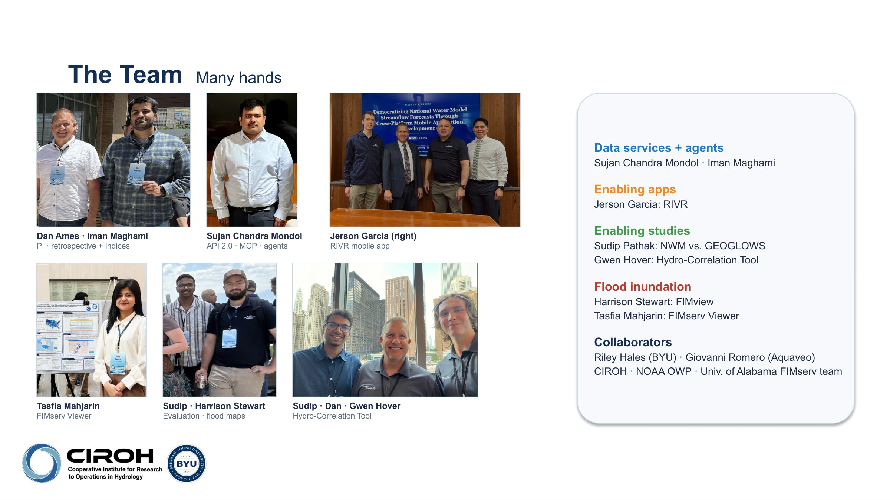

<!--
The team behind this work: data services and agents, the RIVR app, the model evaluation and gage crosswalk, and the flood inundation tools.
-->

---

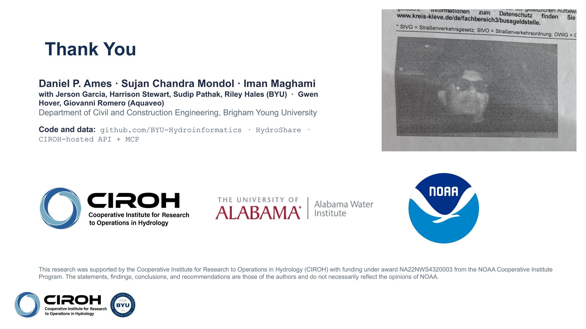

<!--
Thank you. Questions welcome.
-->
